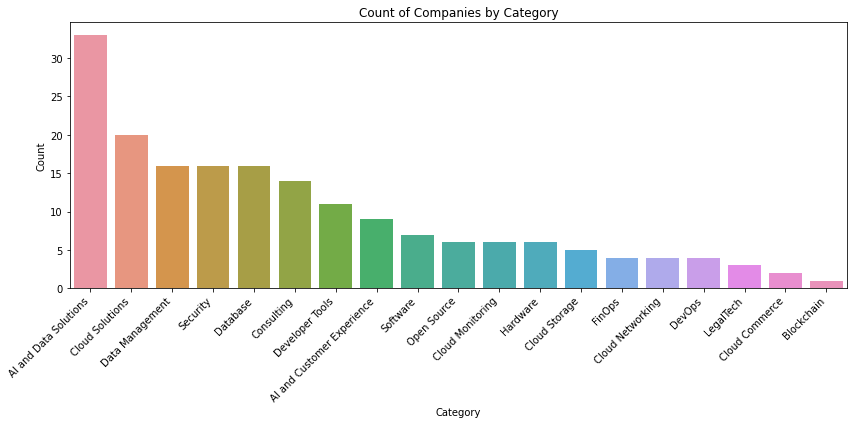

# Introduction

In order to know what are the companies attending the Google Cloud Next 2024 Expo, I decided to walk through all of the booths and record it by [video](https://colab.research.google.com/corgiredirector?site=https%3A%2F%2Fyoutu.be%2FsHjWg9hnK40%3Fsi%3DVW7nAp-xvzfJ14uJ).  It toke me 46 minutes to walk by all of the 200+ booths.

I converted the video to 480p, and use Gemini 1.5 pro to process 46 minutes video for 1 frame per second.

    

## Notebook

You can find the Google Colab nodebook [here](notebook/Google_Cloud_Next_Expo_Video_Processing_with_Gemini_1_5_pro.ipynb).

## Data

The data generated by the Gemini 1.5 pro can be found [here](https://docs.google.com/spreadsheets/d/e/2PACX-1vQQee3yAZb0BPoqK7ZR3wSqXXNX3nOfUc7mditXVUgrwvrPrsUpgChhGIsfzPcBuKJGh8-wq2C5cQ6j/pubhtml).